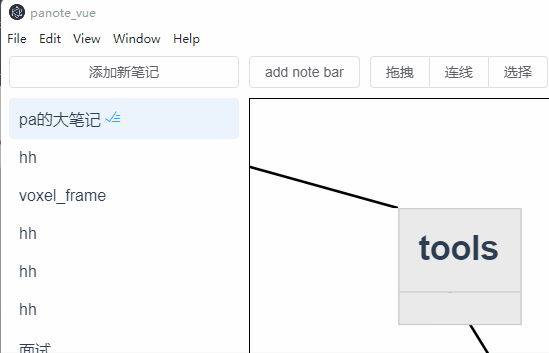
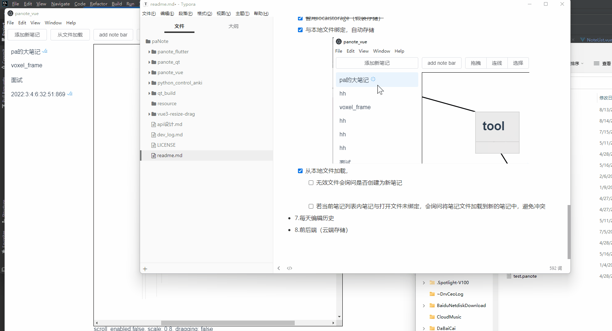
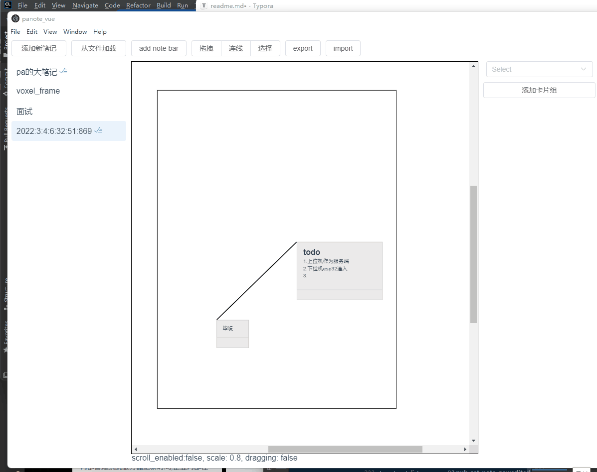

## panote

panote是我自己开发的一个个人笔记软件，将知识平铺开，并用线条关联。我相信知识是相互关联错综复杂的，而工具可以拓宽我们的视野，使我们对知识的整理，检索，复习更高效。

#### Dev Records

[paNote dev log - 飞书云文档 (feishu.cn)](https://bojagybyoq.feishu.cn/docx/JvN1dXL8To0sqZxdRl6cRZSQnYe)

#### User Manual

[paNote docs - 飞书云文档 (feishu.cn)](https://bojagybyoq.feishu.cn/docx/WXcHdQRQyoGtBUxALp5cQgM7nue)

#### Features

- 脑图结构，知识间之间用线连接
- 无限笔记区域，路径间快捷跳转
- 当前主要开发版本在 pa_note_web，网页化使软件的使用途径更旷阔，我也将其作为了个人博客

#### Improvement Space

- use canvas to speed up the render of components

#### Todo

- 作为个人博客，需要一个归档列表列出主要文章

- ~~画布拖拽~~

- ~~内部元素拖拽~~

  - ~~拖拽后面板区域也要实时更新~~

  - ~~添加内部元素~~

  - ~~拖拽，连线，模式切换~~

- ~~控件的辅助按钮~~

- ~~.连线（先直线）~~

  - [ ] 线条样式
  - [ ] 线条换成rotation来表现倾斜
  - [ ] 删除连线
  - [ ] 鼠标在线条上时提供连接块的跳转和预览

- ~~鼠标中心缩放~~

  - [ ] 偏离原点时存在误差问题

- 搜索功能

  - 

- 右键菜单

  - [x] ~~删除~~

  - [x] 点击判断，若发生移动则不触发

    _PaUtilTs.MouseDownUpRecord

  - [ ] 美化

- 3.anki插件（pa）

  - [ ] 卡片组
    - [x] 卡片组创建
    
    - [x] 卡片创建
    
    - [ ] 卡片右键菜单
      - [x] 删除
      - [x] 编辑
      
    - [x] 卡片存储
    
    - [ ] 卡片数据同步到anki
    
      - [x] 添加删除卡片
    
        
    
    - [x] 复习卡片

- 多个笔记

- 4.内部元素的具体内容：~~editor.js（ad）~~
  - ~~quill~~
  - ~~类似命令行的舒服的格式化方式~~
    - [ ] 列表
    - [x] 缩进
    - [ ] 加粗
    - [x] 标题
    - [x] 下划线
    - [x] 代码块切换
    - [ ] 文本样式
      - [ ] 调色
    - [ ] 背景色调色

- 5.存储（先本地（electron））

  - [x] ~~暂用localstorage（假装存储）~~ 已废弃

  - [x] 与本地文件绑定，自动存储

    

  - [x] 从本地文件加载，

    - [x] 无效文件会询问是否创建为新笔记

      

    - [x] 若当前笔记列表内笔记与打开文件未绑定，会询问将笔记文件加载到新的笔记中，避免冲突

      

  - [x] 笔记的卡片数据存储

- 7.每天编辑历史

- 8.前后端（云端存储）

